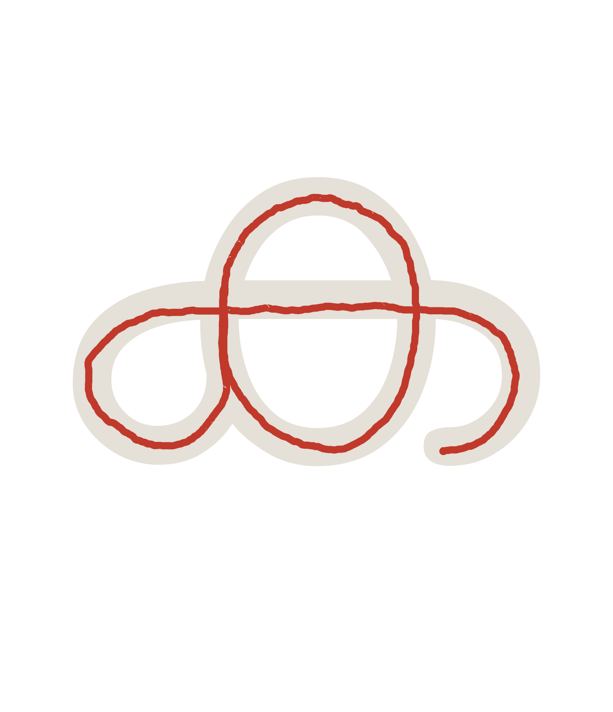
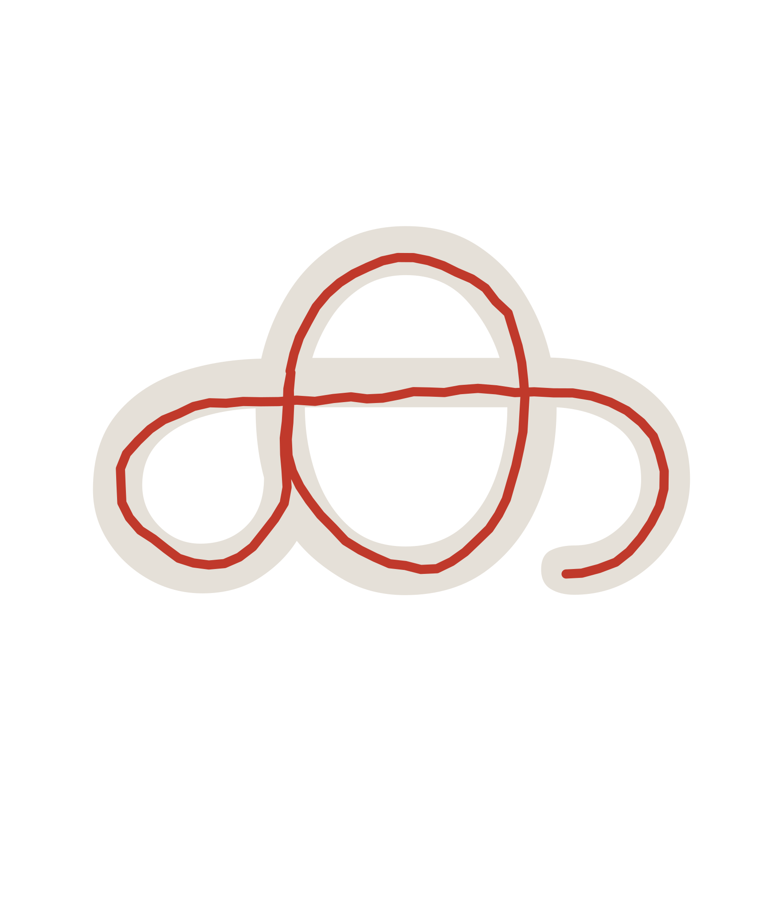
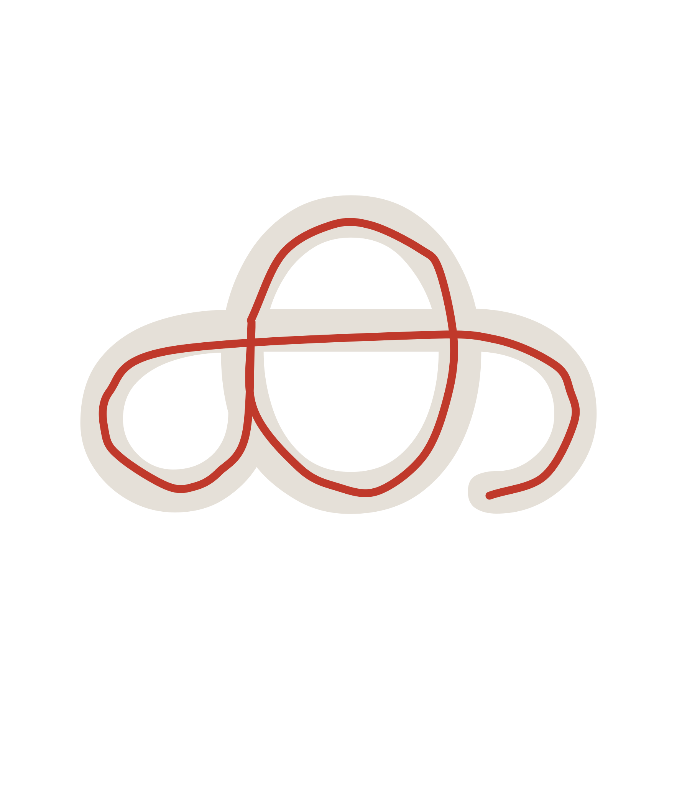

# malayalam-stroker — Pipeline Architecture & Experiments Log

This file has two parts:

- **Part 1** explains how the whole stroke pipeline works end to end — for
  anyone (including future-you, or a contributor extending this to another
  script) trying to understand the system without reading every source file.
- **Part 2 onward** is the experiment log: specific approaches that were
  tried, what went wrong, and why the adopted approach works. Kept as a
  record so nobody re-discovers the same dead ends.

---

# Part 1 — How the pipeline works

```
tools/build_glyph_data.py     ← run once (or when you change fonts)
        │
        ▼
js/src/glyph-data.json        ← font outlines + advance widths + composable
                                 mark recipes (commit this)
        │
tools/stroke-recorder.html    ← native speakers draw centerline strokes,
        │                        filtered to a reduced "atom" set
        ▼
js/src/stroke-data.raw.json   ← hand-authored strokes, exactly as drawn
                                 (commit this — never overwritten by anything)
        │
        ▼
tools/process_strokes.py --preset=malayalam
        │  (center → smooth → straighten → expand)
        ▼
js/src/stroke-data.json       ← processed + composed (commit this — this is
                                 what the widget loads)
        │
        ▼
js/src/index.js               ← self-contained animator; composes anything
                                 not already baked, at request time
```

## Stage 1 — `build_glyph_data.py`: font shaping

Shapes every Malayalam cluster the font can produce (standalone characters,
consonant+matra, conjuncts, anusvara/visarga combos — ~2050 of them) via
HarfBuzz, and writes their outlines + advance widths to `glyph-data.json`.
This file powers two things: the ghost letterform shown during animation,
and the recorder's ghost reference for drawing over.

It also builds a **`marks` table** — a recipe per *composable mark*
(virama, every matra, the subjoined ya/va/la conjunct tails): shape the mark
alone against HarfBuzz's dotted-circle placeholder (inserted automatically
for a combining mark with no base), then split the result at the circle
into a `prefix`/`suffix`/`shift`/`trailingWidth` recipe. That recipe is
enough to attach the mark onto *any* base cluster generically — see
`_build_marks()`'s docstring in `build_glyph_data.py` for the full
derivation and its accuracy limits (a few vowel signs fuse into
consonant-specific ligature shapes that this generic recipe can't
reproduce; see "Composition" below).

**The reduced atom set.** Not every one of the ~2050 clusters needs its own
recorded stroke. Only ~290-something *atoms* do:

- every standalone character (vowels, consonants, chillu, numerals, virama,
  every matra)
- consonant + {ు, ూ, ృ} and similar vowel signs that fuse into a
  consonant-specific shape in real font rendering (can't be composed
  generically — see below)
- the ~108 conjuncts that form true ligatures (also can't be decomposed)

Everything else — plain consonant+matra, conjunct+matra, dead-consonant
forms, subjoined conjunct tails — composes at runtime from those atoms plus
the `marks` recipe. `tools/stroke-recorder.html`'s dropdown defaults to
showing only this reduced set (with a "show all clusters" toggle for the
full ~2050, useful for spot-checking a composed result), so a contributor
is never misled into thinking they need to hand-draw thousands of
combinations.

## Stage 2 — `stroke-recorder.html`: recording

A browser tool where a native speaker draws over the ghost outline for each
atom. Each pen-down→pen-up gesture becomes one stroke. Exports
`stroke-data.raw.json` — the source of truth, never touched by any
processing step.

One easy-to-miss trap for anyone extending this: if a mark's own standalone
ghost includes a HarfBuzz placeholder circle (any mark shaped alone always
does), the *real content* isn't necessarily at the ghost's origin — for a
suffix-type mark the circle comes first and the content sits after it, at
whatever the circle's own width is (empirically ~1131 font-units in this
font). A stroke drawn over that ghost is anchored there too, not at 0. Both
`process_strokes.py`'s centering/straightening reference and
`js/src/index.js`'s runtime composition (`markContentAnchorX`) need to
correct for this anchor — see "Composition" below for the concrete bug
this caused when it was missed.

## Stage 3 — `process_strokes.py`: processing

Four independently-toggleable stages, applied in order to every raw
stroke, `--preset=malayalam` enabling all four:

1. **Center** — gradient-ascent centering onto the glyph's own ink ridge.
   See Part 2.
2. **Smooth** — corner-aware piecewise cubic-spline fit. See Part 3.
3. **Straighten** — ghost-outline-guided angle correction. See Part 4.
4. **Expand** — per-glyph composition: a cluster where every character
   already has its own stroke gets one built by offsetting each into place.
   See Part 5.

The centering/straightening reference for a given cluster is built from
that cluster's own outline in `glyph-data.json` — for a standalone mark
whose ghost includes the placeholder circle, `process_strokes.py`
specifically excludes the circle from that reference (using the `marks`
table's prefix/suffix classification to know which glyph is the real
content), or the circle becomes a second, spurious "ink" blob the gradient
ascent can wander into.

## Stage 4 — `js/src/index.js`: runtime

Loads `glyph-data.json` (always) and `stroke-data.json` (if present,
gracefully absent otherwise). For each word:

1. **Segment** the text into clusters (`resolveSegments`) — longest direct
   match first (conjunct+matra → conjunct → consonant+matra), falling back
   to composing a mark onto the previously-matched segment. A registered
   mark that *also* happens to have its own standalone `clusters` entry
   (every matra, after Stage 1) must still prefer mark composition over
   matching itself as a lone standalone cluster — getting this wrong is
   exactly what caused a real, shipped bug (see "Composition" below).
2. For each segment, look for an authored stroke: pre-baked in
   `STROKE_LIBRARY`, or composed on the fly (`tryComposeStroke`), or — last
   resort — traced from the font's own outline contour.

See Part 5 for how composition actually works, including the bugs this
project hit and fixed while building it out.

## Worked example: one stroke through the pipeline

The stages described above are easiest to understand side by side against
a real stroke. Below is ക (ka)'s recorded stroke at each stage of
`process_strokes.py --preset=malayalam`, overlaid on its Manjari ghost
outline (light tan): its raw `stroke-data.raw.json` entry, then the same
points run through `centering.center_points`, `geometry.smooth_points`, and
`ghost_reference.refine_stroke` in turn — the same four functions
`process_strokes.py` itself calls, just with each stage's output rendered
as a standalone SVG instead of only keeping the final one. These are static
illustrations, not a maintained build artifact — if ക's recorded stroke is
ever re-recorded and the pictures fall out of date, regenerate them with a
short one-off script rather than expecting this doc to stay perfectly in
sync automatically.

**1. Raw** — exactly as recorded, dense with mouse/stylus capture noise:



**2. Centered** — gradient-ascended onto the glyph's ink ridge (Part 2);
still jittery, since centering moves points but never smooths them:



**3. Smoothed** — corner-aware piecewise cubic-spline fit (Part 3); jitter
gone, corners preserved:



**4. Straightened** — ghost-edge-guided angle correction (Part 4). For ക
specifically this stage barely moves anything visible — the letter is
mostly curved, with few long straight ghost edges to correct against — but
the same stage produces a much more visible correction on straighter
letters (e.g. ത, ല):


---

# Part 2 — Centering: Experiments Log

Goal: programmatically correct human-labelled strokes so they run through the
visual centre of the Manjari ghost glyph, without altering the animation or
the original `stroke-data.json`.

---

## Attempt 1 — Rigid Translation (`center_strokes.py`)

**Idea:** Compute the bounding-box centroid of the ghost outline and of the
stroke cloud. Translate all stroke points by the difference vector.

**Result:** Strokes moved visibly (shifts of 20–45 font units), but shape and
jitter were completely unchanged. Centering and smoothing are independent.

**Why it falls short:** A rigid translation corrects the gross offset but
cannot fix per-point deviations. A stroke labelled off-centre on the left side
of a glyph and off-centre on the right will still be wrong after translation.

---

## Attempt 2 — Global Skeleton Snap (first version of `skeleton_strokes.py`)

**Idea:**
1. Rasterize the ghost outline → binary bitmap (512 px over full ascent/descent box).
2. `skimage.skeletonize()` → thinned centerline.
3. For every stroke point, snap it to the globally nearest skeleton pixel (KD-tree).
4. Fit a bezier through the snapped cloud.

**Result:** Stroke completely destroyed. Points near branch junctions teleported
to wrong branches on the opposite side of the letter.

**Root cause:** Global nearest-neighbour without a radius guard makes every
point near a junction ambiguous. The assembled point cloud had no topological
coherence with the original stroke path.

---

## Attempt 3 — Local Nudge with Radius Guard (second version)

**Idea:** Same skeleton, but instead of hard-snapping, only pull points within
`SNAP_RADIUS = 60` font units toward the skeleton by `SNAP_ALPHA = 0.8`.
Points further away are left untouched.

**Result:** Better than attempt 2, but SNAP_RADIUS was too small (~3% of UPM).
Only 22–60% of points were nudged; the rest stayed in their original (wrong)
positions.

---

## Attempt 4 — Tight Bounding Box + `medial_axis` + Larger Radius

**Changes:**
- Raster viewport switched from full ascent/descent box to the outline's own
  tight bounding box → ~4× finer pixel resolution.
- Resolution increased from 512 → 1024 px.
- `skeletonize` replaced with `medial_axis` (distance-transform ridge, more
  geometrically precise).
- `SNAP_RADIUS` raised to 300 font units → 100% of points nudged.

**Result:** 100% of points nudged, but output is visually garbled — jagged
outlines, wrong shapes.

**Root cause (fundamental):** The medial axis of a *filled* glyph outline is
NOT the stroke trajectory. For a thick letter like ജ:
- The skeleton runs through the geometric centre of the ink width.
- It branches at every curve, loop junction, and serif.
- None of those branches correspond to a human writing gesture.
- Snapping a stroke path onto this branching structure scatters points
  to geometrically valid but semantically wrong locations.

---

## Why the Problem Is Hard

A rendered glyph encodes *what* to draw (filled shapes), not *how* to draw it
(ordered pen strokes). The mapping from filled outline → stroke trajectory is
the reverse of what a calligrapher does, and is not injective:
- Multiple distinct stroke orderings can produce the same glyph shape.
- Thick strokes look the same whether drawn left-to-right or right-to-left.
- Loops in the medial axis correspond to circular strokes, but the skeleton
  gives a ring with no start/end — the human stroke resolves this implicitly.

---

## Possible Forward Paths

### A — Accept the human stroke as authoritative; only smooth it
Use `snap_strokes.py` (cubic B-spline fit). The stroke is already roughly
centred if the labeller was careful. This is the current production path.

### B — Per-point projection onto the *nearest outline edge* (not skeleton)
Instead of pulling toward the skeleton, project each stroke point onto the
nearest point on the glyph *outline contour*. Then pull inward by half the
local stroke width (estimated from the distance transform at that point).
This is a local operation with no branch ambiguity.

### C — Thin-plate spline warp
Manually or automatically identify a sparse set of anchor points where the
human stroke clearly deviates from the skeleton branch it belongs to, then
fit a thin-plate spline that maps stroke points to corrected positions while
preserving the overall topology.

### D — Train a small model
Given enough (stroke, glyph) pairs, a sequence model could learn to map raw
stroke point sequences to corrected ones. Requires labelled data.

### E — Better labelling tooling
Add a live skeleton overlay to `stroke-recorder.html` so the labeller can see
the medial axis while drawing and aim for it directly. Removes the need for
post-processing correction entirely.

---

## Resolution — Gradient Ascent (adopted)

A variant of B that turned out to work: rather than snapping to the
skeleton or projecting onto the outline, walk each stroke point a small,
fixed number of steps *up the gradient* of the distance-transform field
(toward higher "depth inside the ink"). Following the local gradient from a
point's own neighbourhood — rather than a global nearest-skeleton-pixel
search — is what avoids the "teleport to the wrong branch near a junction"
failure that sank Attempts 2–4: the point can only climb the ridge it's
already closest to, not jump across it.

This is the approach now used in production, consolidated (from the
`center_strokes_v2.py` / `refine_with_ghost.py` prototypes referenced above)
into `python/src/malayalam_stroker/centering.py`, and run via
`tools/process_strokes.py --center`. The exploratory scripts this log
documents (`center_strokes.py`, `skeleton_strokes.py`, `center_strokes_v2.py`)
have been removed now that their logic lives in the shared module; this file
is kept as the record of why the simpler approaches didn't work.

A deliberate limitation: `N_ASCENT_STEPS` (20) and `ASCENT_STEP_PX` (0.6) cap
how far a single call can move a point — a bounded *nudge* toward center, not
a full snap. A stroke drawn very far off-center will end up *more* centered,
not perfectly centered. This is intentional: an unbounded ascent reintroduces
Attempt 2's failure mode on complex/self-intersecting shapes (`MAX_SHIFT_FU`
guards the same risk from the other direction, blending back toward the
original position if a single ascent call wants to move a point too far).

---

# Part 3 — Smoothing

`python/src/malayalam_stroker/geometry.py`, run via
`tools/process_strokes.py --smooth`.

**The problem a single global spline creates.** A hand-drawn stroke is noisy
— natural hand tremor, plus whatever the recording UI's own point-capture
adds. Fitting one cubic B-spline through the whole thing forces C1
(tangent) continuity everywhere. At a genuine corner — a stroke reversing
direction, e.g. a downstroke turning into a foot — enforcing a smooth
tangent through that reversal makes the fitted curve swing wide to stay
smooth, which shows up as a spurious loop or bulge that was never actually
drawn.

**The fix: corner-aware piecewise fitting.**
1. Simplify the sampled stroke points with Ramer-Douglas-Peucker
   (`rdp`), to get a waypoint polyline that keeps only points that
   materially change direction.
2. Compute the turning angle at each interior waypoint (`turn_angles`).
3. Split the polyline into pieces wherever the turn exceeds
   `CORNER_ANGLE_DEG` (50°) — `split_at_corners`. Consecutive pieces share
   their boundary point, so the pieces stay positionally connected.
4. Fit each corner-free piece independently as its own cubic spline
   (`fit_piece`, via `scipy.interpolate.splprep`/`splev`, converted from
   Hermite tangents to Bezier control points) and stitch the pieces back
   into one SVG path (`smooth_points`).

A piece with fewer than 4 distinct points (not enough for a cubic fit) falls
back to straight `L` segments — the natural, correct result for a piece
that's just two corner points with nothing between them anyway.

**Known limitation.** Cubic spline fitting is naturally less constrained at
the very start/end of an unclamped piece — a small amount of residual wiggle
right at a stroke's endpoint (as opposed to along its middle) can survive
smoothing even when the rest of the stroke looks clean. If you see this,
it's a real, understood characteristic of the current fitting approach, not
a separate bug — a fix would mean either clamping the endpoint tangent
explicitly or applying extra smoothing weight near piece boundaries.

---

# Part 4 — Straightening

`python/src/malayalam_stroker/ghost_reference.py`, run via
`tools/process_strokes.py --straighten`.

**The problem.** Smoothing fixes jitter, but a hand-drawn "straight" line is
never drawn at *exactly* the font's intended angle — a horizontal stroke
might be recorded at 1-2° off true horizontal. That's imperceptible on its
own, but adds up visually across a whole word.

**Why outline edges can't be used directly as a reference.** A hand-drawn
stroke is a *centerline* running through the middle of the ink, offset from
the glyph outline's boundary by roughly half the local stroke width. Naively
snapping a drawn line to the nearest outline edge would snap it too close to
the boundary, not to the centerline.

**The approach:**
1. Sample the glyph's raw outline contours (`sample_outline`) and find
   long, genuinely straight edge segments within them (`find_straight_segments`
   — a straight-run search bounded by `STRAIGHT_TOLERANCE`/`STRAIGHT_MIN_LENGTH`).
2. Gradient-ascend sample points along each straight outline edge into the
   ink, using the exact same `centering.center_points` machinery from Part 2
   — climbing from the boundary to the local ridge gives the centerline that
   edge implies, at whatever the local stroke width actually is.
3. Fit a line through the ascended points (`fit_line`, PCA-based) and keep it
   as a reference only if the fit is clean (`REF_MAX_RESIDUAL`) — this
   discards edges near corners/junctions, where ascent can wander toward the
   wrong local ridge, same failure mode as Part 2's Attempts 2–4.
4. For a hand-drawn stroke: split it into corner-free pieces the same way
   smoothing does (`split_path_into_pieces`), and for each straight-enough
   piece (`STRAIGHT_RESIDUAL_TOLERANCE`/`MIN_STRAIGHT_PIECE_LENGTH`), find the
   closest-matching reference by angle and perpendicular distance
   (`match_reference`). A match gets rigidly rotated about its own (fixed)
   start point to the reference's exact angle; no match means the piece is
   kept as authored, just rigidly translated to stay attached at the
   corner after any neighboring correction.

Straightening only ever *rotates* — it never resamples or reshapes a piece,
so a curved piece (correctly identified as not straight) is left completely
untouched.

---

# Part 5 — Composition: from ~290 atoms to arbitrary words

This is the part of the pipeline most likely to grow new edge cases as the
project (or a new script built the same way) covers more ground, so it's
worth understanding in more depth than the README's summary — including two
concrete bugs this project shipped and fixed, as worked examples of the
failure modes to watch for.

## The mark recipe (glyph level)

`build_glyph_data.py`'s `marks` table (Stage 1 above) gives every
composable mark a `{ shift, prefix, suffix, trailingWidth }` recipe.
`js/src/index.js`'s `composeMark(base, mark)` uses it to build a *glyph
outline* for any base+mark pair that isn't already a pre-shaped direct
cluster: prefix glyphs go before the base (shifted by `mark.shift`), the
base's own glyphs shift right by `mark.shift`, and suffix glyphs go after
the base's advance. This is real, HarfBuzz-derived font geometry — always
correct, and unaffected by anything below.

## The same recipe, for strokes (`applyMarkStroke`)

Composing a *stroke* (not an outline) for a mark reuses the identical
shift math, offsetting the mark's own recorded stroke instead of its glyph
outline. This is `js/src/index.js`'s `applyMarkStroke`, mirrored in Python
as `stroke_compose.py`'s `_char_dx`/`compose_per_glyph` for the offline
bake step.

**Bug #1 — the anchor correction, and the regression it can cause.** A
mark's own recorded stroke is anchored wherever its *own* ghost put it — see
Stage 2's note above. For a mark that's always had a proper ghost (like
anusvara), that's fine. But when a matra later *gains* a standalone ghost
for the first time (so it can finally be recorded properly), any code that
composes it needs to know the anchor changed, or it'll silently misplace
every word using that matra. Concretely, on this project: adding standalone
ghosts for all matras retroactively activated the anchor-correction branch
in `stroke_compose.py`'s `_char_dx` for characters that had never been
ghost-aligned — instantly regressing *every already-baked* consonant+aa/i/ii
combination (previously fine only by coincidence, since a blindly-drawn
stroke has no real anchor to get wrong). The fix was a temporary
`NOT_YET_GHOST_ALIGNED` exclusion list (removed once those specific matras
were re-recorded against their real ghost) in both `stroke_compose.py` and
`js/src/index.js` — kept here as a lesson: *adding a ghost to a
previously-blind mark is not purely additive; anything that reads that
mark's own anchor needs re-auditing at the same time.*

**Bug #2 — segmentation must prefer mark composition over a mark's own
direct match.** Once a matra has its own standalone `clusters` entry (Stage
1), it becomes a *valid direct cluster match in its own right* — which
means `resolveSegments`'s longest-match-first scan could match it as a
standalone segment instead of attaching it as a mark to the *previous*
segment. Concretely: typing a conjunct+matra combination rendered with the
matra split off as an orphaned, isolated segment — visibly showing its own
dotted-circle-placeholder ghost shape instead of composing onto the
conjunct. The fix: `resolveSegments`'s direct-match tier only tries lengths
4/3/2 first; length-1 direct matches are tried only *after* mark
composition has already had its chance, and only when there's no previous
segment to attach to (or mark composition genuinely doesn't apply). See
`tests/index.test.js`'s "prefers mark composition over a mark's own
standalone direct match" test for the regression test this produced.

## Compound vowel signs: decompose, don't hand-draw

ൊ/ോ/ൌ each attach *both* a prefix and a suffix piece — one recorded stroke
can't represent that (there's no way to cleanly re-offset a single stroke's
middle gap to match an arbitrary base's width). Rather than hand-recording
these three characters directly, they decompose into their real parts —
which happen to match Unicode's own canonical NFD decomposition exactly:
ൊ→െ+ാ, ോ→േ+ാ, ൌ→െ+ൗ (`SPLIT_VOWEL_PARTS` in `index.js`,
`_SPLIT_VOWELS` in `build_glyph_data.py`). Each part is a simple
single-sided mark, applied one after another (`applySequentialMarkStrokes`)
using the exact same `applyMarkStroke` machinery. ൈ is the one exception —
it has no Unicode decomposition, and in this font renders as a single
prefix-only glyph rather than two, so it's recorded (and composed) as its
own ordinary atom.

## Recursive composition

`tryComposeStroke` doesn't require its base to already be cached in
`STROKE_LIBRARY` — if the base is itself a shorter cluster with no stroke
yet, it's composed recursively first (bottoming out at a real recorded
atom within the cluster's own length, so recursion is always bounded).
This matters for any *chain* of marks: a conjunct+matra combination like
ദ്യു first needs its own base "ദ്യ" (itself `ദ` + the subjoined-ya mark
"്യ") composed before "ു" can attach to it. Before this was recursive, any
mark chain more than one link deep silently fell through to the plain
font-outline trace instead of a real composed stroke — not wrong, just a
visibly different (and, worse, occasionally including a stray
dotted-circle artifact, per Bug #2 above) style from its neighbors.

## Last resort: per-character fallback

If neither direct composition nor mark-chain recursion applies, both engines
fall back to treating every character in the cluster as its own independent
atom and placing each one's own recorded stroke at its own glyph slot
(`stroke_compose.py`'s `compose_per_glyph`, mirrored as
`tryComposeFromCharacters` in `index.js`). This only fires when the
character count exactly matches the glyph count — a mismatch means some
character actually contributes more than one glyph (a mark attachment, not
independent characters placed side by side), and naively mapping characters
to glyph slots 1:1 in that case silently misassigns them (verified
concretely for "കൊ": the base consonant was left unshifted while the
compound vowel's stroke absorbed a shift meant for a different sub-part).
However imperfect the result — no font ligatures, just each atom's own
shape offset into place — it's still closer to the real word than an
outline trace, for any cluster where every character happens to have its
own recorded stroke.
